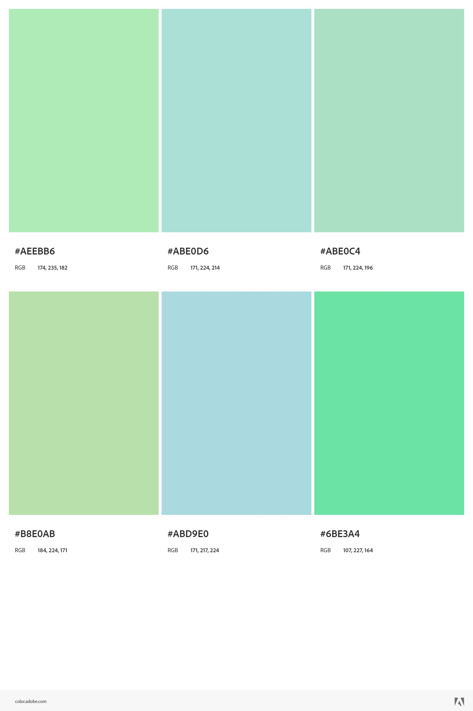

# 29_teste_diel

### Dois projetos separados nas pastas do repositório

### Back → Node

→ Setup do projeto

- Criar uma instância do mongodb, recomendo usar um container docker para facilitar a execução do projeto
- Configurar a porta correta do container para ser passado no código, nesse caso usei a porta padrão 27017
- Para testar o back separadamente, você pode abrir um cliente http qualquer, como postman, insomnia, ou caso queira, você pode usar o thunder client no VS Code
- Há uma collection exportada com os endpoints criados, sinta-se a vontade para usar

→ Yarn

- Fiz o uso do yarn para gerência de pacotes, então basta instalar o yarn e executar um yarn install, para instalar as dependências
- Depois de ter instalado as dependências, você pode rodar o projeto normalmente, ou usar o script que foi criado na package.json
    - yarn dev
- Estou usando nodemon, então ele vai executar por baixo dos panos, usando o ts-node também

→ Estrutura e Rotas

- Fiz algumas modificações nos models que foram propostos, mas nada muito mirabolante
- Basicamente há 3 tipos de entidades, Tag, User e Task
- Um usuário, tem várias tags e tasks
- Quando a aplicação inicia, você “loga” e esse usuário que é criado no “login” fica sendo passado para as outras entidades
- Estou fazendo assim enquanto não implemento a parte de autenticação, pois vai ser feito caso sobre tempo

### Front → React

→ Setup do projeto

- Além de ter o node instalado, basta que você clone o projeto e rode, nesse caso com yarn, um yarn (para baixar as dependencias) e um yarn dev
- Lembre de subir o back juntamente

